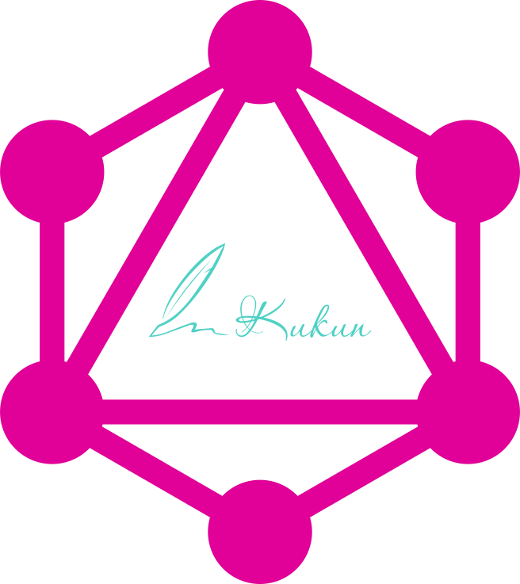

<p align="center">
<a href="/" target="_blank">

</a></p>

<p align="center">
<a>rustc 1.62.0 (fe5b13d68 2022-05-18)</a> |
<a>Microsoft C++ Build Tools</a> |
<a>Cargo 1.62.0</a>
</p>

___

## Command Line

- Cập nhật Rust:
  `rustup update`
- Gỡ cài đặt Rust:
  `rustup self uninstall`
- Kiểm tra phiên bản Rust:
  `rustc --version`
- Kiểm tra phiên bản Cargo:
  `cargo --version`
- Mở Document Project
  `cargo doc --open`
- Generate Secret Key 256-bit base64 key:
  `openssl rand -base64 32`

___

- Writing Automated Tests:
  `cargo test`

- Check a Cargo Project:
  `cargo check`

- Building a Cargo Project:
  `cargo build`
  `cargo build --release` or `cargo build -r`

- Building and Running a Cargo Project:
  `cargo run`
  `cargo run --release` or `cargo run -r`

- Reload automatically when I change source code:
  `cargo watch -x run`

___

## Install Enviroment

> https://visualstudio.microsoft.com/visual-cpp-build-tools/
>
> https://www.rust-lang.org/
>
> https://rocket.rs/

### Cargo uses conventions for file placement to make it easy to dive into a new Cargo package:

```
├── Cargo.lock
├── Cargo.toml
├── src/
│ ├── lib.rs
│ ├── main.rs
│ └── bin/
│     ├── named-executable.rs
│     ├── another-executable.rs
│     └── multi-file-executable/
│         ├── main.rs
│         └── some_module.rs
├── benches/
│   ├── large-input.rs
│   └── multi-file-bench/
│       ├── main.rs
│       └── bench_module.rs
├── examples/
│   ├── simple.rs
│   └── multi-file-example/
│       ├── main.rs
│       └── ex_module.rs
└── tests/
    ├── some-integration-tests.rs
    └── multi-file-test/
        ├── main.rs
        └── test_module.rs
```

***

- `Cargo.toml` and `Cargo.lock` are stored in the root of your package (package root).
- Source code goes in the `src` directory.
- The **default library** file is `src/lib.rs`.
- The **default executable** file is `src/main.rs`.
    - **Other executables** can be placed in `src/bin/`.
- **Benchmarks** go in the `benches` directory.
- **Examples** go in the `examples` directory.
- **Integration tests** go in the `tests` directory.

If a `binary`, `example`, `bench`, or `integration test` consists of multiple source files, place a main.rs file along
with the
extra [modules](https://doc.rust-lang.org/cargo/appendix/glossary.html#module) within a subdirectory of the `src/bin`
, `examples`, `benches`, or `tests` directory. The name of the
executable

will be the directory name.

You can learn more about Rust's module system in
the [book](https://doc.rust-lang.org/book/ch07-00-managing-growing-projects-with-packages-crates-and-modules.html).

See [Configuring a target](https://doc.rust-lang.org/cargo/reference/cargo-targets.html#configuring-a-target) for more
details on manually configuring targets.
See [Target auto-discovery](https://doc.rust-lang.org/cargo/reference/cargo-targets.html#target-auto-discovery) for more
information on controlling how Cargo automatically infers target names.